# Yapay Zekâ Destekli Akıllı Asistan

[](https://www.python.org/)
[](https://react.dev/)
[](https://vite.dev/)
[](https://flask.palletsprojects.com/)
[](https://www.mongodb.com/)
[](https://jwt.io/)

PDF, DOCX, PPTX, ses, görsel ve web kaynaklarını tek bir sohbet arayüzünde birleştiren full-stack bilgi erişim uygulaması.

> Bu, iki geliştirici tarafından birlikte geliştirilen ortak bir projedir.

## Proje hakkında

Akademik çalışmalarda bilgi; PDF dosyaları, sunumlar, görseller, ses kayıtları ve web sayfaları gibi farklı kaynaklara dağılır. Bu proje, bu kaynaklardan metin çıkararak kullanıcının seçtiği içerikler üzerinden doğal dilde soru sormasını ve özet almasını amaçlar.

Uygulama; kullanıcı hesaplarını, sohbet odalarını, kaynakları ve mesaj geçmişini yönetir. Kaynak türüne göre uygun metin çıkarma bileşeni çalışır ve elde edilen içerik, ilgili sohbet odasının bağlamına eklenir.

### Proje ekibi

- **Ayyüce Özge Abban** — Frontend geliştirme ve kullanıcı arayüzü
- **Emir Kıvrak** — Backend geliştirme ve servis altyapısı

## İçindekiler

- [Özellikler](#özellikler)
- [Desteklenen kaynaklar](#desteklenen-kaynaklar)
- [Ekran görüntüleri](#ekran-görüntüleri)
- [Teknik mimari](#teknik-mimari)
- [Kullanım ve kaynak işleme akışı](#kullanım-ve-kaynak-işleme-akışı)
- [API özeti](#api-özeti)
- [Kullanılan teknolojiler](#kullanılan-teknolojiler)
- [Gereksinimler](#gereksinimler)
- [Kurulum ve çalıştırma](#kurulum-ve-çalıştırma)
- [Proje yapısı](#proje-yapısı)
- [Yapılandırma](#yapılandırma)
- [Sınırlamalar](#sınırlamalar)

## Özellikler

- Kullanıcıya özel sohbet odaları, mesaj geçmişi ve kaynak yönetimi
- Seçili kaynaklara dayalı soru-cevap ve özetleme
- Markdown ve LaTeX biçimli yanıtları görüntüleme
- E-posta doğrulama, Google ile giriş, kayıt ve şifre yönetimi
- JWT access/refresh token tabanlı oturum yönetimi
- Türkçe ve İngilizce arayüz

## Desteklenen kaynaklar

| Kaynak | Frontend dosya seçimi / bağlantı | Backend işlemi |
|---|---|---|
| Belgeler | PDF, DOCX, PPTX | Metin çıkarma |
| Ses | MP3; backend’de WAV, M4A, OGG | AssemblyAI ile transkripsiyon |
| Görsel | JPG, JPEG, PNG | Google Cloud Vision ile OCR |
| Web | Web sayfası bağlantısı | Paragraf metni çıkarma |
| Haber | Haber bağlantısı | Makale metni çıkarma |
| Video | YouTube bağlantısı | Ses indirme ve transkript çıkarma |

WAV, M4A ve OGG uzantıları backend extractor katmanında desteklenir; mevcut frontend dosya seçicisi bu uzantıları doğrudan listelemez.

## Ekran görüntüleri

Görseller uygulama akışına göre gruplanmıştır. Geniş ekranlar ve paneller iki sütunda, e-posta şablonları üç sütunda gösterilir. Tüm görseller sabit yükseklik kullanılmadan, özgün oranları korunarak sınırlandırılmıştır.

### Kimlik doğrulama ve hesap yönetimi

<table border="1" cellpadding="10" cellspacing="0" width="100%">
<tr>
<td valign="top" width="50%"><p align="center"><strong>Giriş ekranı</strong><br><sub>Kullanıcı girişi ve dil seçimi.</sub><br>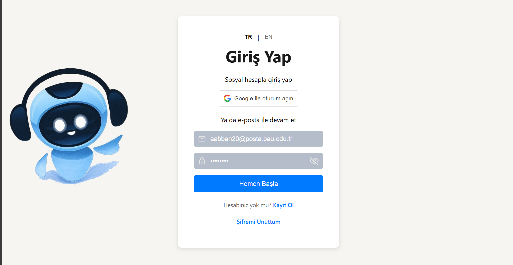</p></td>
<td valign="top" width="50%"><p align="center"><strong>Kayıt ekranı</strong><br><sub>Yeni kullanıcı hesabı oluşturma.</sub><br>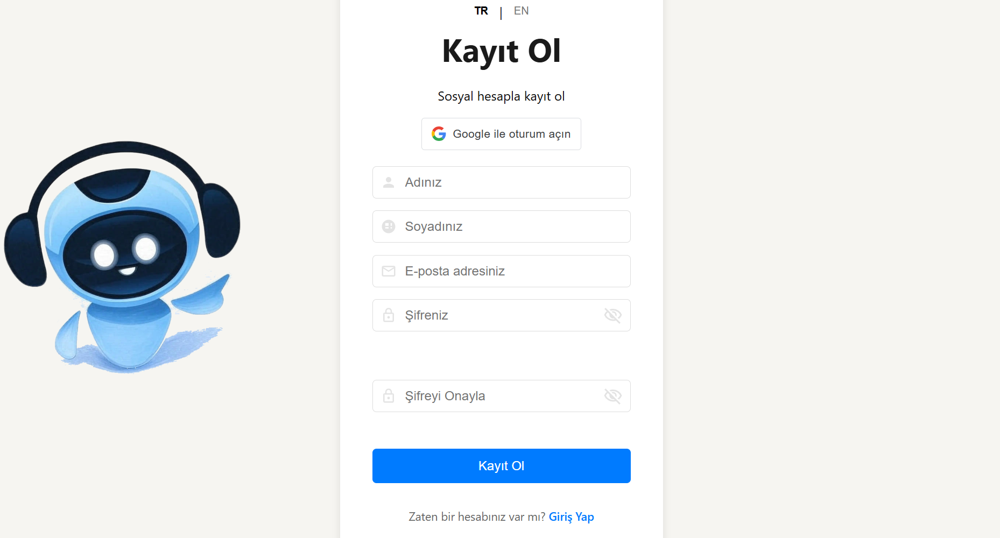</p></td>
</tr>
<tr>
<td valign="top"><p align="center"><strong>Şifremi unuttum</strong><br><sub>Şifre sıfırlama bağlantısı isteme.</sub><br>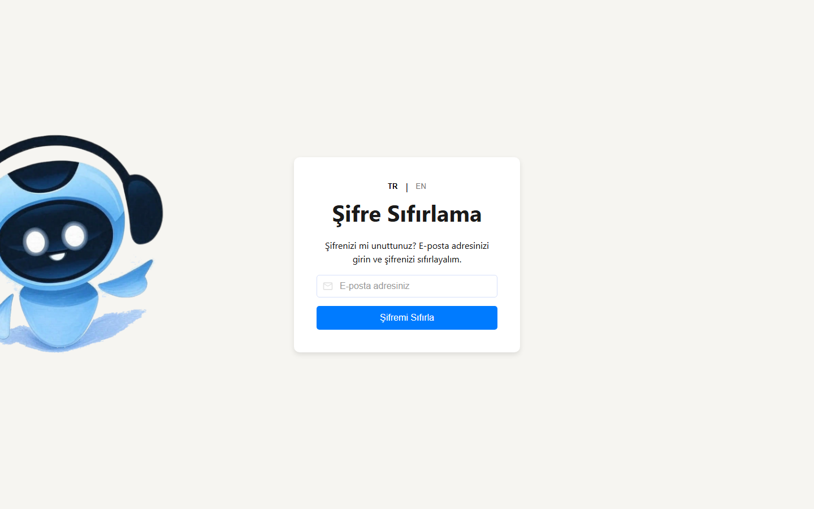</p></td>
<td valign="top"><p align="center"><strong>Yeni şifre belirleme</strong><br><sub>Geçerli bağlantıyla yeni parola oluşturma.</sub><br>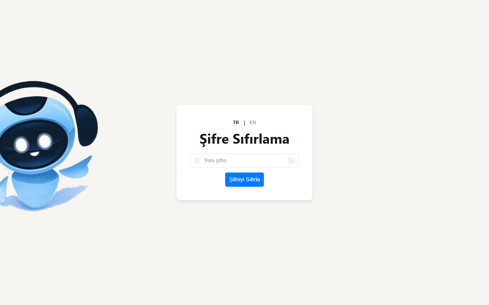</p></td>
</tr>
<tr>
<td colspan="2" valign="top"><p align="center"><strong>Profil</strong><br><sub>Kullanıcı bilgileri ve parola değiştirme.</sub><br>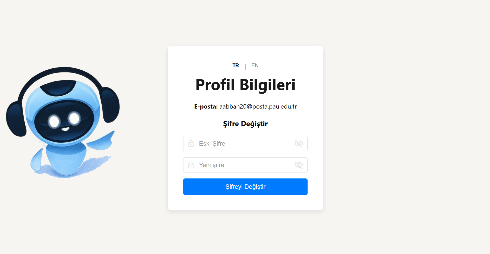</p></td>
</tr>
</table>

#### E-posta şablonları

<table border="1" cellpadding="10" cellspacing="0" width="100%">
<tr>
<td valign="top" width="33%"><p align="center"><strong>Doğrulama e-postası</strong><br><sub>Kayıt sonrası gönderilen doğrulama mesajı.</sub><br>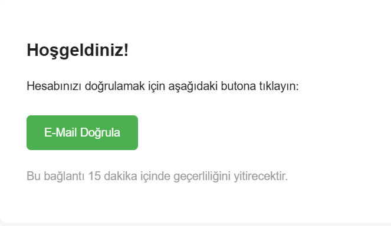</p></td>
<td valign="top" width="33%"><p align="center"><strong>Şifre sıfırlama e-postası (TR)</strong><br><sub>Türkçe parola yenileme mesajı.</sub><br>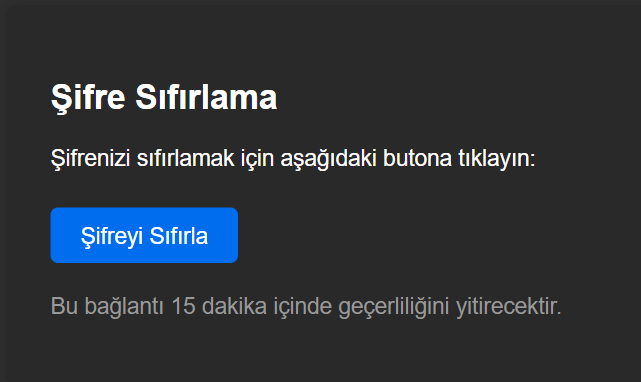</p></td>
<td valign="top" width="33%"><p align="center"><strong>Şifre sıfırlama e-postası (EN)</strong><br><sub>İngilizce parola yenileme mesajı.</sub><br>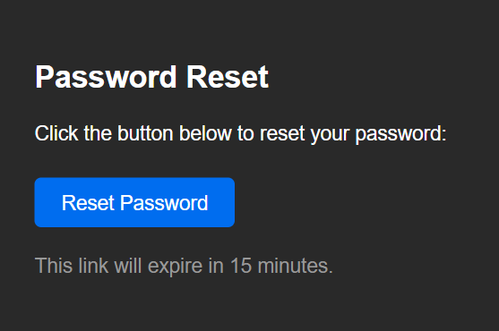</p></td>
</tr>
</table>

### Kaynak ve belge yönetimi

<table border="1" cellpadding="10" cellspacing="0" width="100%">
<tr>
<td valign="top" width="50%"><p align="center"><strong>Kaynaklar paneli (Türkçe)</strong><br><sub>Yüklenen kaynakların Türkçe listesi.</sub><br>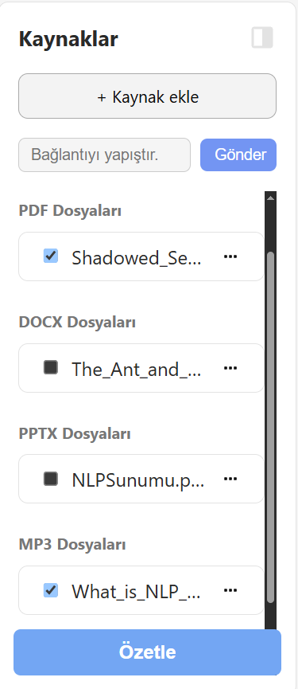</p></td>
<td valign="top" width="50%"><p align="center"><strong>Kaynaklar paneli (İngilizce)</strong><br><sub>Kaynak panelinin İngilizce arayüz görünümü.</sub><br>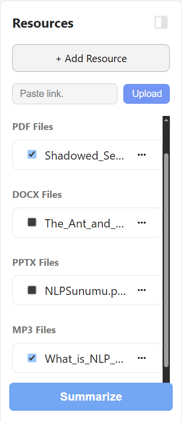</p></td>
</tr>
</table>

### Sohbet ve yanıtlar

<table border="1" cellpadding="10" cellspacing="0" width="100%">
<tr>
<td valign="top" width="50%"><p align="center"><strong>Markdown tablo yanıtı</strong><br><sub>Belge içeriğinden tablo biçimli yanıt.</sub><br>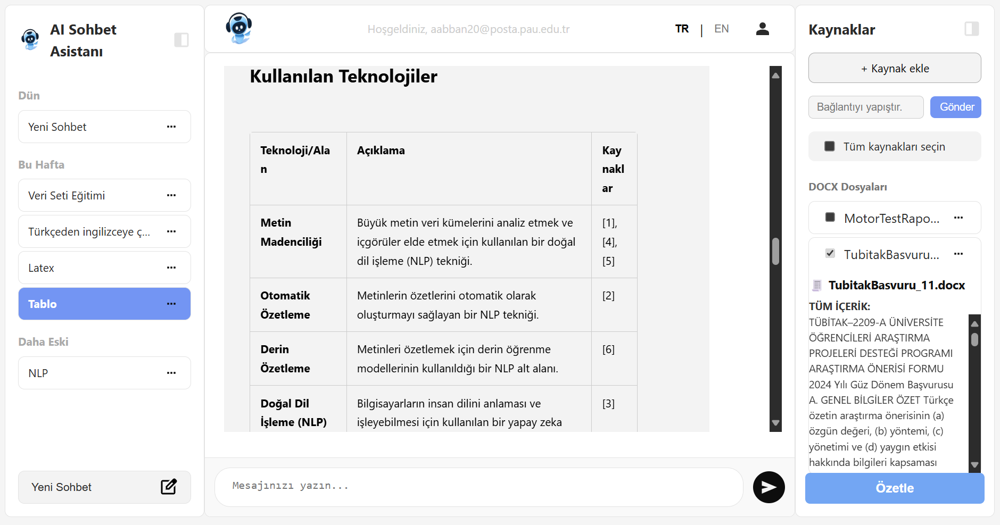</p></td>
<td valign="top" width="50%"><p align="center"><strong>LaTeX yanıtı</strong><br><sub>Matematiksel formülün biçimlendirilmiş gösterimi.</sub><br>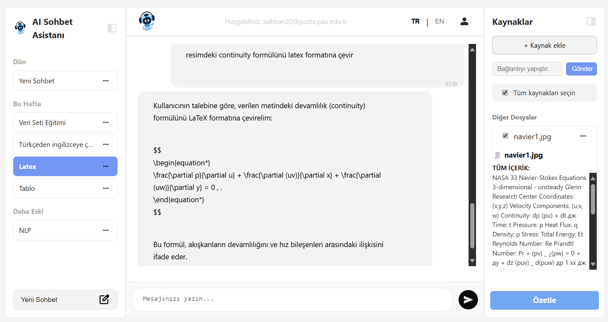</p></td>
</tr>
<tr>
<td valign="top"><p align="center"><strong>Çok dilli yanıt</strong><br><sub>Türkçe sorgu ve farklı dilde model yanıtı.</sub><br>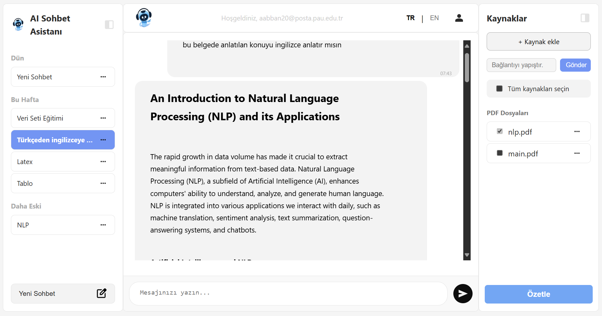</p></td>
<td valign="top"><p align="center"><strong>Çoklu kaynaklarla sohbet</strong><br><sub>PDF, PPTX, MP3 ve web kaynağının birlikte kullanıldığı sohbet.</sub><br>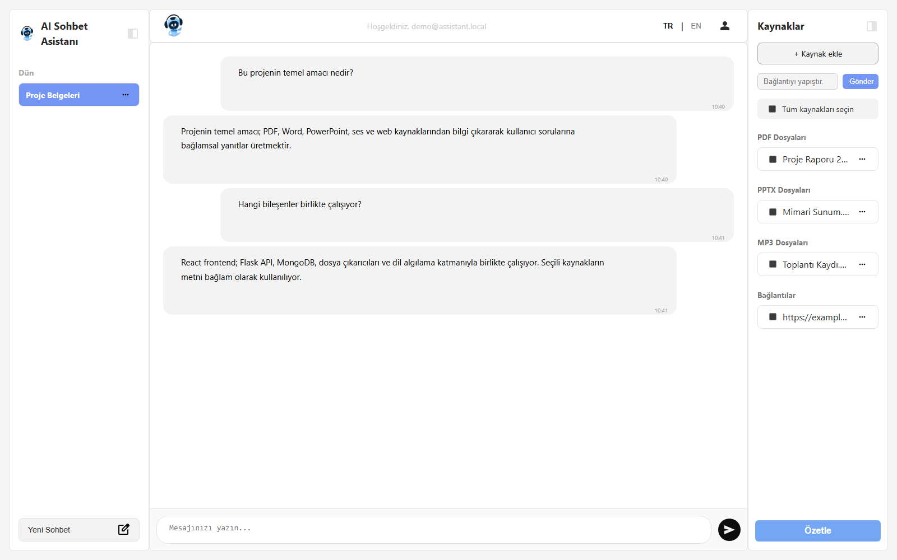</p></td>
</tr>
</table>

## Teknik mimari

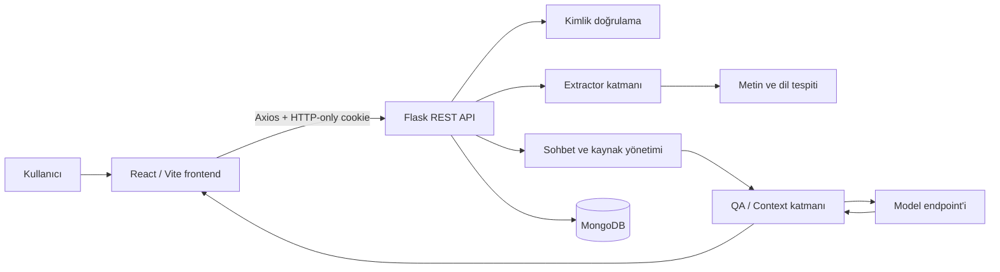

Frontend kullanıcı etkileşimlerini ve uygulama durumunu yönetir. Flask backend kimlik doğrulama, sohbet odaları, mesajlar, kaynak işlemleri ve metin çıkarma akışını yürütür. Çıkarılan içerikler MongoDB’de saklanır ve seçili kaynaklar QA katmanına bağlam olarak iletilir.

## Kullanım ve kaynak işleme akışı

1. Kullanıcı bir sohbet odası oluşturur ve dosya veya bağlantı ekler.
2. Backend, sohbet odasının kullanıcıya ait olduğunu doğrular.
3. Kaynak türüne göre ilgili extractor seçilir.
4. Dosyadan veya bağlantıdan metin çıkarılır; gerektiğinde OCR ya da transkripsiyon uygulanır.
5. Kaynak metadata bilgileri ve çıkarılan içerik MongoDB’ye kaydedilir.
6. Kullanıcının seçtiği kaynaklar soru-cevap ve özetleme akışına bağlam olarak aktarılır.

## API özeti

Tüm korumalı endpoint’ler kimlik doğrulama gerektirir. İsteklerde frontend tarafından yapılandırılan `VITE_API_URL` temel adres olarak kullanılır.

| Grup | Method | Endpoint | Amaç |
|---|---:|---|---|
| Auth | POST | `/auth/login` | Kullanıcı girişi |
| Auth | POST | `/auth/register` | Kullanıcı kaydı |
| Auth | POST | `/auth/refresh` | Access token yenileme |
| Auth | POST | `/auth/logout` | Oturumu kapatma |
| Auth | GET | `/auth/me` | Aktif kullanıcı bilgisi |
| Auth | GET | `/auth/verify-email` | E-posta doğrulama |
| Auth | POST | `/auth/forgot-password` | Şifre sıfırlama bağlantısı isteme |
| Auth | POST | `/auth/reset-password` | Yeni şifre belirleme |
| Auth | POST | `/auth/google-login` | Google token ile giriş |
| Auth | POST | `/auth/change-password` | Oturum açmış kullanıcının şifresini değiştirme |
| Chat | GET | `/chat/fetch-chat-rooms` | Kullanıcının sohbet odalarını getirme |
| Chat | POST | `/chat/new-chat` | Yeni sohbet odası oluşturma |
| Chat | GET | `/chat/fetch-messages` | Oda mesajlarını getirme |
| Chat | POST | `/chat/send-message` | Mesaj gönderme |
| Chat | POST | `/chat/delete-room` | Sohbet odası silme |
| Chat | POST | `/chat/rename-room` | Sohbet odası adını değiştirme |
| Upload | POST | `/chat/upload-and-chat` | Dosya yükleme ve işleme |
| Upload | POST | `/chat/upload-link-and-chat` | Web, haber veya YouTube bağlantısı işleme |
| File | POST | `/chat/delete-file` | Kaynağı silme |
| File | POST | `/chat/rename-file` | Kaynağı yeniden adlandırma |
| Document | GET | `/documents/documents` | Belgeleri listeleme |
| Document | GET | `/documents/documents/user` | Kullanıcının belgelerini listeleme |

Dosya, kaynak ve sohbet odası işlemlerinde sahiplik kontrolü uygulanır. Böylece bir kullanıcı başka bir kullanıcıya ait odaya veya dosyaya erişemez.

## Kullanılan teknolojiler

### Frontend

- React.js
- Vite
- React Router
- Zustand
- Axios
- react-i18next
- react-markdown ve remark-gfm
- react-toastify

### Backend

- Python ve Flask
- MongoDB ve PyMongo
- PyMuPDF
- python-docx
- python-pptx
- BeautifulSoup ve Newspaper3k
- AssemblyAI entegrasyonu
- Google Cloud Vision entegrasyonu
- PyJWT ve bcrypt

## Gereksinimler

- Python 3.10 veya üzeri
- Node.js 18 veya üzeri ve npm
- Çalışan bir MongoDB sunucusu
- YouTube kaynakları için `yt-dlp`
- E-posta akışlarını yerel ortamda test etmek için isteğe bağlı Mailpit
- OCR, ses transkripsiyonu ve bazı bağlantı türleri için ilgili dış servis erişimleri

Windows üzerinde geliştirme yapılırken PowerShell kullanılması önerilir. YouTube bağlantılarının işlenmesi için `yt-dlp` sistem PATH’inde bulunmalıdır.

## Kurulum ve çalıştırma

### Backend

```bash
cd backend
python -m venv .venv
```

Windows PowerShell:

```powershell
.\.venv\Scripts\Activate.ps1
pip install -r requirements.txt
pip install yt-dlp
Copy-Item .env.example .env
python app.py
```

Backend varsayılan olarak `http://127.0.0.1:8000` adresinde çalışır.

### Frontend

```bash
cd frontend
npm install
npm run dev
```

Frontend varsayılan olarak `http://127.0.0.1:5173` adresinde açılır.

Frontend üretim derlemesini almak veya lint kontrolü çalıştırmak için:

```bash
npm run build
npm run lint
```

## Yapılandırma

`backend/.env.example` ve `frontend/.env.example` dosyaları kopyalanarak ilgili `.env` dosyaları oluşturulmalıdır.

Backend:

```env
SECRET_KEY=uzun-ve-guvenli-bir-gizli-anahtar
MONGO_URI=mongodb://127.0.0.1:27017
DB_NAME=chatbot
FRONTEND_URL=http://127.0.0.1:5173
MODEL_API_URL=http://127.0.0.1:5005
ASSEMBLY_API_KEY=
GOOGLE_APPLICATION_CREDENTIALS=
```

Frontend:

```env
VITE_API_URL=http://127.0.0.1:8000
VITE_GOOGLE_CLIENT_ID=
```

MongoDB’nin çalışır durumda olması gerekir. Bu repository içinde AI/model servisi bulunmaz; backend soru-cevap isteklerini `MODEL_API_URL` ile tanımlanan harici `/qa` endpoint’ine gönderir. Bu endpoint yapılandırılmadığında kaynak yükleme ve metin çıkarma çalışabilir, ancak soru-cevap yanıtı üretilemez.

E-posta gönderimi, OCR ve ses transkripsiyonu için ilgili dış servislerin ayrıca yapılandırılması gerekebilir. Gizli anahtarlar ve servis kimlik bilgileri repository’ye eklenmemelidir.

## Proje yapısı

```text
AI-Digital-Assistant/
├── backend/
│   ├── controllers/       # API endpoint controller'ları
│   ├── core/              # Veritabanı, güvenlik, mail ve extractor'lar
│   │   └── extractors/    # PDF, DOCX, PPTX, ses, web ve OCR extractor'ları
│   ├── services/          # Auth, chat, upload, document ve QA servisleri
│   │   └── qa/            # Bağlam oluşturma ve QA istemcisi
│   ├── routes/            # Flask route kayıtları
│   └── app.py             # Backend giriş noktası
├── frontend/
│   ├── src/api/           # Axios ve API yardımcıları
│   ├── src/components/    # Ortak bileşenler ve sidebar'lar
│   ├── src/features/chat/ # Sohbet ekranı
│   ├── src/pages/         # Auth ve profil sayfaları
│   ├── src/store/         # Zustand state yönetimi
│   ├── src/locales/       # Türkçe ve İngilizce çeviriler
│   └── src/utils/         # Frontend yardımcıları
└── assets/                # README ekran görüntüleri
```

## Sınırlamalar

- Soru-cevap, OCR, ses transkripsiyonu ve bazı web/YouTube içerikleri dış servis veya araç ayarlarına bağlıdır.
- YouTube extractor’ı çalıştırmak için `yt-dlp` kurulumu gerekir.
- Dosya yükleme boyutu backend’de 10 MB ile sınırlıdır.
- Bir sohbet odasında frontend tarafından en fazla 5 kaynak desteklenir.
- MP4 dosya yükleme desteklenmez; video içeriği YouTube bağlantısı üzerinden işlenir.
